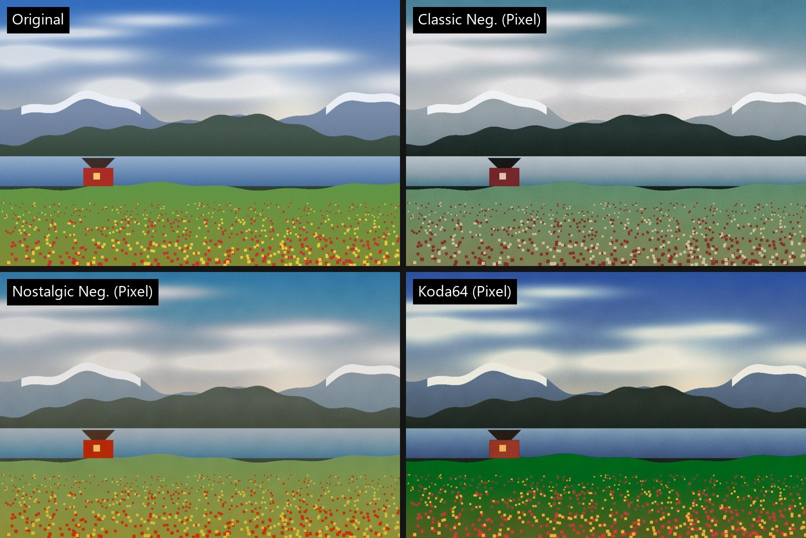

<p align="center"></p>

# FujiVibe

**An Android camera app that gives phone photos a Fujifilm-style film look, tuned for how Pixel phones actually process their photos.**

Film looks made for Fujifilm cameras tend to look flat or muddy on phone photos, because phones already brighten shadows and flatten contrast before you ever see the image. FujiVibe keeps the familiar looks but rebuilds each one for Pixel photos, tuned by eye against real shots. The app itself stays simple: shoot, swipe between looks, save the ones you like.



<sub>The scene is computer-generated, so no personal photos are published. It was rendered by the app's own color engine.</sub>

## How it works

1. **Shoot:** back or selfie camera, with zoom, ISO and shutter speed on one fold-away ruler. Leave ISO or shutter on Auto and the camera fills it in; set both for full manual, with a brightness readout (e.g. `+1.0 EV`). The top bar holds a grid, a level line, a 3s/10s self-timer and the photo shape: 4:3, 3:2 (Fujifilm's native shape), 1:1 or 16:9.
2. **Review:** swipe between *Original*, *Classic Neg. (Pixel)*, *Nostalgic Neg. (Pixel)* and *Koda64 (Pixel)*. A line under the photo shows what it was shot with, e.g. `ISO 400 · 1/250 · 1x · 3:2`.
3. **Export:** save the look you're on at full resolution to `Pictures/FujiVibe`, with the photo's date and camera settings kept. You can save several looks from the same shot.
4. **Done:** back to the camera, ready for the next shot.

No download is published yet. Build it with the commands below and install it on an Android 10+ phone. It was built and tested on a Pixel 10 Pro.

## What makes it different

- **Looks adjusted for phone photos.** Each look combines the original film-look color table with extra corrections (contrast, tint, color shifts), all merged into a single table. The app does one quick lookup per pixel, and retuning a look means changing a few numbers.
- **A Kodachrome-inspired look.** *Koda64 (Pixel)* approximates a popular Kodachrome 64 recipe: warm light, deep blue skies, rich color and gentle highlights, with skin tones kept natural.
- **Choose after you shoot.** You compare looks on the actual photo instead of guessing from a live preview.
- **Camera-like controls.** Manual ISO and shutter speed with an Auto option for each, a level line, and a 3:2 frame, presented like a camera's own display.

## Build it

Requires JDK 21 and the Android SDK.

```bash
./gradlew :render:test :app:testDebugUnitTest :app:assembleDebug
```

```bash
adb install -r app/build/outputs/apk/debug/app-debug.apk
```

To preview any photo through the looks on a computer, without a phone:

```bash
./gradlew :render:previewFilmSimulation --args="in.jpg out.jpg ORIGINAL,CLASSIC_NEG_PIXEL,NOSTALGIC_NEG_PIXEL,KODA64_PIXEL"
```

The project has two parts: a color engine (`render/`) that is plain Kotlin and fully unit-tested, and the Android app (`app/`), built with Jetpack Compose and CameraX.

## Limitations

- Saving a full-resolution photo can take tens of seconds.
- Looks are tuned by eye on a limited set of photos, and low-light shots come out dark.
- No flash or portrait (background blur) mode. The Pixel 10 Pro doesn't offer portrait blur to other apps.
- With one of ISO or shutter set by hand, the other is based on the scene when you started adjusting, and doesn't follow later changes in light.
- Tested on one phone; no store release.

## Roadmap

- Fine-tune *Koda64 (Pixel)* on more real Pixel photos.
- Faster saving.
- A downloadable release.
- Later ideas: an in-app gallery, telling close-up portraits from landscapes automatically, and cropping to the main face.

## Privacy

FujiVibe works entirely on your phone. It only asks for camera access and cannot use the internet: no accounts, tracking or ads. The level line reads the phone's motion sensor on the device only, and your camera settings are remembered on the phone. Photos go only to your phone's `Pictures/FujiVibe` folder.

## License and credits

- **Code:** [MIT](LICENSE).
- **Color tables** (`derived-luts/`): adapted from [abpy/FujifilmCameraProfiles](https://github.com/abpy/FujifilmCameraProfiles) by abpy, under [CC BY-NC-SA 4.0](https://creativecommons.org/licenses/by-nc-sa/4.0/) (non-commercial, share-alike). See [details](derived-luts/LICENSE.md).
- **Font:** [Barlow Semi Condensed](https://github.com/jpt/barlow) by The Barlow Project Authors, under the [SIL Open Font License 1.1](third_party/BarlowSemiCondensed-OFL.txt).
- **Icons:** [Material Symbols](https://github.com/google/material-design-icons) by Google, under the Apache License 2.0.
- FujiVibe is an independent project, not affiliated with Fujifilm, Kodak or Google. Look names refer to their trademarks only to describe the styles the app approximates.

## How this project was built

I led this project as its product owner: I set the direction and scope, made the product decisions (what to build, what to cut, how each look should feel), judged every look on real photos, and tested every change on my own phone. AI coding agents (Claude Code) did most of the implementation, working to my direction.

What kept the work reliable:

- **Written decisions.** A product spec, a glossary and a log of key decisions, so work never depended on memory.
- **Small, well-defined tasks,** each with a clear finish line.
- **Automated tests and a build check** before any change was accepted.
- **Hands-on testing on a real phone.** My feedback drove the fixes. Some ideas, like portrait mode, were dropped after testing showed the phone didn't support them.
- **A clear Git history** of small, described changes.
